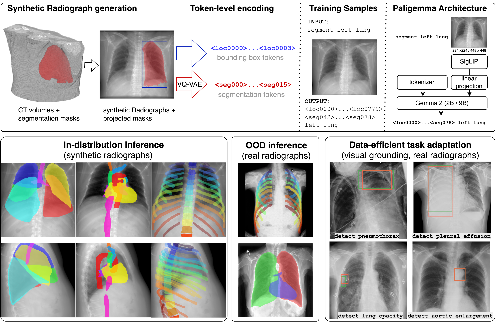

# CheXanatomy: Anatomy-Aware Vision-Language Modeling for Chest Radiographs

This repository accompanies the paper *CheXanatomy: Anatomy-Aware Vision-Language Modeling for Chest Radiographs*.

Paper: [arXiv:2606.08420](https://arxiv.org/abs/2606.08420)

Demo: [Hugging Face Space](https://huggingface.co/spaces/sgatidis/CheXanatomy)

**Sergios Gatidis, Curtis Langlotz, Christian Bluethgen**  
Stanford Center for Artificial Intelligence in Medicine and Imaging, Stanford University  
Department of Radiology, Stanford University

**Abstract**  
Vision-language models pretrained on large-scale image-text pairs demonstrate strong image-level understanding, but are primarily optimized for global alignment and do not explicitly encode fine-grained anatomical structure, limiting their suitability for spatially precise tasks such as segmentation.

CheXanatomy integrates explicit anatomical knowledge into a pretrained vision-language model through autoregressive token-space supervision. Instead of adding task-specific decoder heads, the model is trained to generate anatomical segmentation masks via next-token prediction. To enable scalable supervision, the framework synthesizes realistic chest radiographs from CT volumes and forward-projects CT segmentation labels to obtain anatomically consistent 2D masks.

The repository contains the code used to generate anatomy-aware training data, construct autoregressive supervision targets, train the model, and run the demo workflows used in the paper. Synthetic chest radiograph training data can be generated from the CT-RATE dataset using the CheXsynth repository: [sergiosgatidis/CheXsynth: Synthetic Chest Radiograph Generation from 3D CT volumes](https://github.com/sergiosgatidis/CheXsynth).

A public CheXanatomy adapter release is available on Hugging Face: [sgatidis/chexanatomy-paligemma-3b-224](https://huggingface.co/sgatidis/chexanatomy-paligemma-3b-224).



*Overview of CheXanatomy. CT volumes with anatomic labels are projected into synthetic CXRs, and bounding boxes and segmentation masks are encoded into structured tokens. A pretrained vision-language model based on the PaliGemma architecture is fine-tuned to autoregressively generate anatomical bounding boxes and segmentations via next-token prediction. The trained model approaches convolutional baselines in-distribution and demonstrates improved geometric robustness under domain shift, while supporting adaptation to new localization tasks. Unlike conventional segmentation networks, no task-specific decoder heads are introduced, and supervision is applied entirely in token space.*

## Repository Overview

This codebase supports the main components of the CheXanatomy paper:

- generation of anatomically consistent 2D supervision from CT-derived labels
- autoregressive anatomy supervision using location and segmentation tokens
- training and evaluation workflows for anatomy-aware chest radiograph VLMs
- lightweight demo notebooks for data generation, training, and inference

## Project Structure

```
cheXanatomy/
├── README.md                           # This file
├── LICENSE                             # MIT license
├── requirements.txt                    # Python dependencies
├── config_public.yaml                # Publication-safe example configuration
├── pyproject.toml                    # Package/build configuration
│
├── training_file_generation/          # NPZ data processing & batch generation
│   ├── generate_training_files.py    # Core NPZ generation from CT data  
│   └── batch_training_object_generation.py  # Batch processing with parallel execution
│
├── utils/                             # Core processing utilities
│   ├── anatomy_utils.py              # Bounding box & segmentation token generation
│   ├── VQVAE_encoder_utils.py        # VQVAE encoding for segmentation masks
│   └── VQVAE_decoder_utils.py        # Token decoding and mask reconstruction
│
├── paligemma_training_data/          # Training sample generation
│   └── paligemma_training_sample_generator.py  # Multi-task training sample creation
│
├── training/                         # Model training orchestration
│   └── train_paligemma.py           # Paligemma model training script
│
├── demo/                             # Demo notebooks
│   ├── data_generation_demo.ipynb   # Read CT_RATE demo data, export NPZ, inspect samples
│   ├── training_demo.ipynb          # Prepare demo config and run a few training steps
│   └── inference_demo.ipynb         # Load demo images and run inference
│
├── models/                          # Model weights and artifacts
│   └── vae-oid.npz                 # VQVAE model weights
└── CT_RATE_demo_data/                # Small demo dataset for notebooks and examples
```

## Training Tasks

The training pipeline supports multiple anatomy-aware supervision tasks:

### 1. **Detection Tasks**
- `detect heart` → `<loc0400><loc0312><loc0703><loc0625> heart`
- Teaches model to locate and identify anatomical structures

### 2. **Segmentation Tasks**  
- `segment lung` → `<seg045><seg023>...<seg089> lung`
- Provides precise shape understanding through VQVAE-encoded masks

### 3. **Bbox Identification Tasks**
- `caption <loc0400><loc0312><loc0703><loc0625>` → `heart`
- Trains model to recognize structures from location tokens

### 4. **Mask Identification Tasks**
- `caption <seg045><seg023>...<seg089>` → `lung`
- Enables structure recognition from segmentation tokens

### 5. **Visual Bbox Identification**
- Shows bounding box overlay on image → `heart`
- Teaches visual pattern recognition with spatial boundaries

### 6. **Visual Mask Identification**
- Shows segmentation mask overlay on image → `lung`
- Provides shape-based visual learning with precise anatomical boundaries

## Repository Features

- Efficient NPZ generation from large CT-derived datasets
- Data augmentation with synchronized token updates
- Bidirectional coordinate and token conversion utilities
- Support for PA and LR projection data
- Visual anatomy supervision tasks with overlays
- TensorFlow and JAX-based VQ-VAE utilities for mask encoding and decoding

## Quick Start

### 1. Installation

```bash
git clone https://github.com/sergiosgatidis/cheXanatomy.git
cd cheXanatomy
pip install -e .
```

### 2. Generate Training Data

```bash
# Batch process PA projections
python training_file_generation/batch_training_object_generation.py \
  --input_dir /path/to/CT_RATE_projections_PA \
  --output_dir /path/to/training_data

# Batch process LR projections
python training_file_generation/batch_training_object_generation.py \
  --input_dir /path/to/CT_RATE_projections_LR \
  --output_dir /path/to/training_data
```

If you need to synthesize chest radiographs from CT volumes first, use the CT-RATE dataset together with [CheXsynth](https://github.com/sergiosgatidis/CheXsynth), then process the resulting projections with this repository.

### 3. Generate Training Samples

```python
from paligemma_training_data.paligemma_training_sample_generator import PaligemmaSampleGenerator

# Initialize with NPZ data
generator = PaligemmaSampleGenerator('/path/to/case.npz', enable_augmentation=True)

# Generate samples for all task types
detection_sample = generator.generate_sample('detection', 'heart')
segmentation_sample = generator.generate_sample('segmentation', 'lung')
visual_bbox_sample = generator.generate_sample('bbox_identification', 'spine')

# Each sample contains: prefix, suffix, image, task_type, structure
print(f"Task: {detection_sample.prefix}")
print(f"Answer: {detection_sample.suffix}")
```

### 4. Train Paligemma Model

```bash
python training/train_paligemma.py --config config_public.yaml
```

A pretrained public adapter is available at [sgatidis/chexanatomy-paligemma-3b-224](https://huggingface.co/sgatidis/chexanatomy-paligemma-3b-224) if you want to skip training and go directly to inference.

## Usage

### Data Processing Pipeline

#### Single Case Processing
```bash
# Process individual CT case to NPZ format
python training_file_generation/generate_training_files.py \
  --single_case /path/to/case_directory \
  --output_dir outputs/
```

#### Batch Processing (Workstation)
```bash
# Run PA and LR processing directly from one workstation shell
python training_file_generation/batch_training_object_generation.py \
  --input_dir /path/to/CT_RATE_projections_PA \
  --output_dir /path/to/CT_RATE_training_data

python training_file_generation/batch_training_object_generation.py \
  --input_dir /path/to/CT_RATE_projections_LR \
  --output_dir /path/to/CT_RATE_training_data
```

### Training Sample Generation

#### Basic Sample Generation
```python
from paligemma_training_data.paligemma_training_sample_generator import PaligemmaSampleGenerator

generator = PaligemmaSampleGenerator('/path/to/case.npz')

# Generate specific task types
tasks = ['detection', 'segmentation', 'bbox_identification', 'mask_identification']
for task in tasks:
    sample = generator.generate_sample(task, 'heart')
    print(f"{task}: {sample.prefix} → {sample.suffix}")
```

#### Augmentation-Enhanced Generation
```python
# Enable data augmentation
generator = PaligemmaSampleGenerator('/path/to/case.npz', enable_augmentation=True)

# Generate augmented samples with random transformations
sample = generator.generate_sample('detection', 'lung')
# Automatically applies random scale (0.7-1.3x) and position offsets
# Updates bounding boxes and segmentation tokens accordingly
```

### Demo Notebooks

#### Focused Demo Notebooks
```bash
# Data generation demo
jupyter notebook demo/data_generation_demo.ipynb

# Training demo
jupyter notebook demo/training_demo.ipynb

# Inference demo
jupyter notebook demo/inference_demo.ipynb
```

## Data Format & Structure

### Input Data Organization
```
case_directory/
├── ct.png                    # Main chest X-ray image (PA or LR projection)
├── heart.png                 # Individual anatomical structure masks
├── lung_left.png            
├── lung_right.png           
├── spine.png                
├── clavicle_left.png        
└── [additional_structures].png
```

### Generated NPZ Format
Each processed case generates an NPZ file containing:
```python
{
    'img_array': numpy.ndarray,      # Normalized image array (512x512)
    'metadata': {
        'case': str,                 # Case identifier (e.g., 'train_1234_a_2_PA')  
        'orientation': str,          # 'PA' or 'LR'
        'num_structures': int,       # Number of detected structures
        'structure_info': {
            'heart': {
                'bbox': [y_min, x_min, y_max, x_max],           # Pixel coordinates
                'bbox_norm': [y_min, x_min, y_max, x_max],      # Normalized (0-1)
                'bbox_token': '<loc0400><loc0312>...',           # Paligemma tokens
                'segmentation_token': '<loc...><seg045>...',     # Combined tokens
                'label': 'heart'                                # Structure name
            },
            # ... additional structures
        }
    }
}
```

### Training Sample Output
Generated training samples follow this structure:
```python
TrainingSample(
    prefix="detect heart",                                    # Task prompt
    suffix="<loc0400><loc0312><loc0703><loc0625> heart",     # Expected output  
    image=PIL.Image,                                         # Processed image
    task_type="detection",                                   # Task category
    structure="heart"                                        # Target structure
)
```

## Environment

### Hardware Requirements
- **CPU**: Multi-core processor (parallel processing supported)
- **Memory**: 4GB+ RAM (batch processing may require more)
- **GPU**: NVIDIA GPU with CUDA support (for VQVAE operations)
- **Storage**: Sufficient space for NPZ files (typical case: 2-5MB per NPZ)

### Software Dependencies
- **Python**: 3.9+
- **TensorFlow**: 2.8+ (with GPU support recommended)
- **PIL/Pillow**: Image processing
- **NumPy**: Array operations  
- **Conda**: Environment management

## License & Citation

This project is licensed under the MIT License. See the LICENSE file in the repository root.

Some bundled components are derived from the Big Vision PaliGemma demo and are redistributed under Apache License 2.0:

- `utils/VQVAE_encoder_utils.py`
- `utils/VQVAE_decoder_utils.py`
- `models/vae-oid.npz`

See `LICENSES/Apache-2.0.txt` for the Apache 2.0 license text and `models/vae-oid.npz.NOTICE` for the model artifact notice and source attribution.

If you use this code in your research, please cite:

```bibtex
@article{gatidis2026chexanatomy,
  title={CheXanatomy: Anatomy-Aware Vision-Language Modeling for Chest Radiographs},
  author={Gatidis, Sergios and Langlotz, Curtis and Bluethgen, Christian},
  year={2026},
  journal={arXiv preprint arXiv:2606.08420},
  url={https://arxiv.org/abs/2606.08420}
}
```